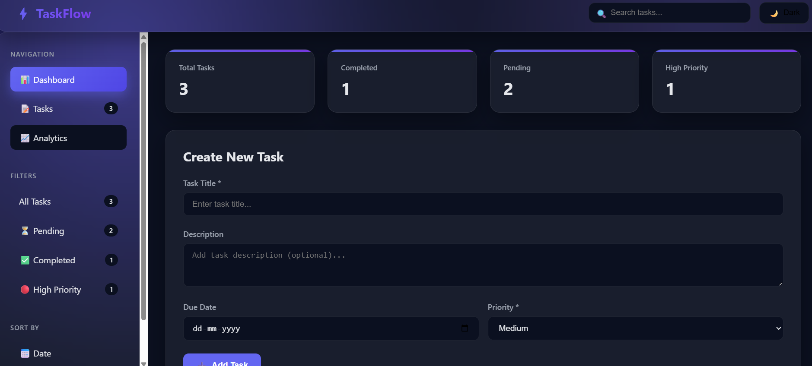
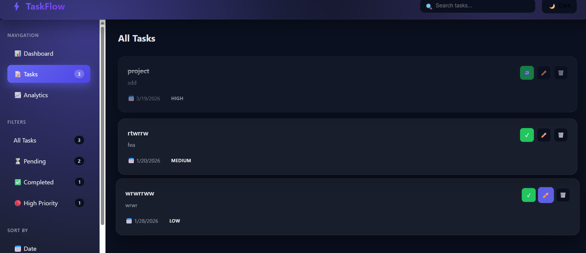
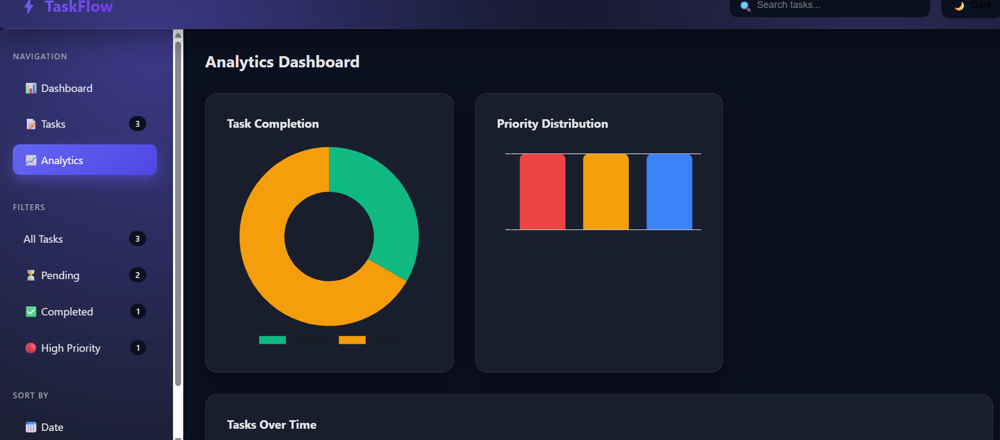
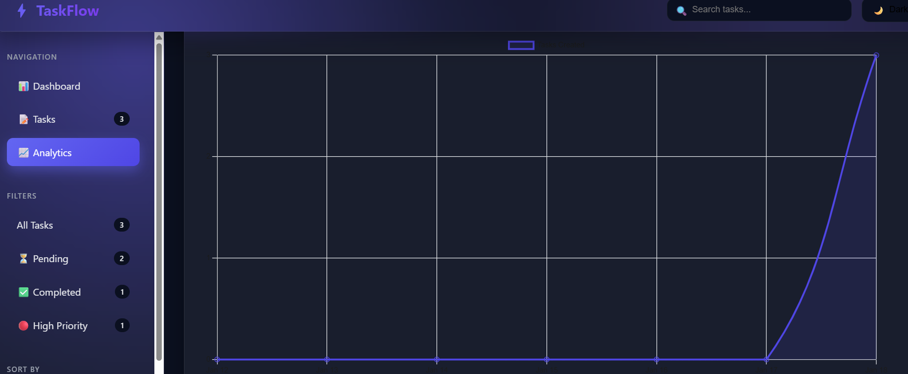

 Task Flow

A clean and simple **task management dashboard** built using HTML, CSS, and JavaScript.

Task Flow helps users organize tasks, track progress, and visualize productivity.

---

## 🔗 Live Demo

https://shrirajsonvane.github.io/task-flow/

---

## 📸 Screenshots

### Dashboard


### Tasks Management


### Analytics View


### Charts Overview


---

## ✨ Features

- Task management system
- Dashboard overview
- Analytics section
- Visual charts
- LocalStorage support
- Clean UI layout

---

## 🛠️ Technologies Used

- HTML5  
- CSS3  
- JavaScript (Vanilla JS)  
- Browser LocalStorage  

---

## 🚀 How to Run Locally

1. Clone the repository
```bash
git clone https://github.com/shrirajsonvane/task-flow.git
Open index.html in browser or Live Server

📈 Future Improvements
Task categories

Due dates

Dark mode

Backend integration

User authentication

👨‍💻 Author
Shriraj Sonvane
GitHub: https://github.com/shrirajsonvane

⭐ If you like this project, consider giving it a star!